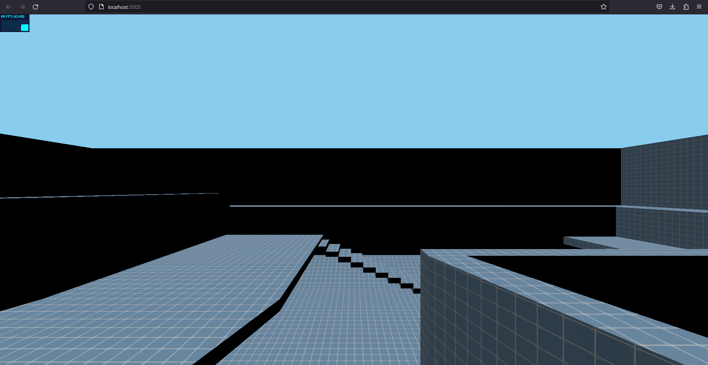
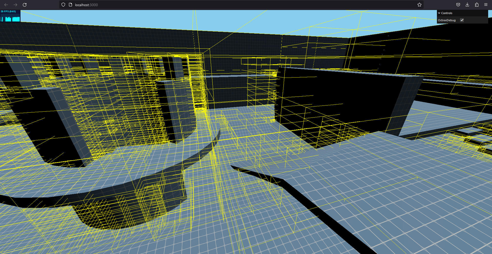
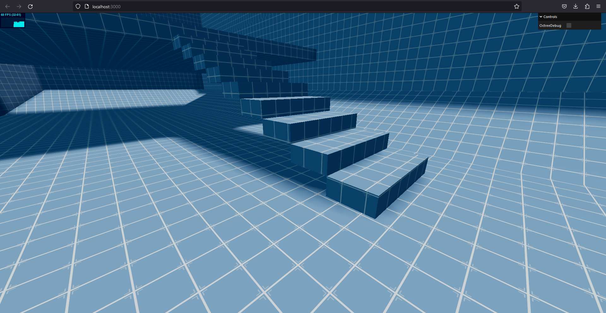
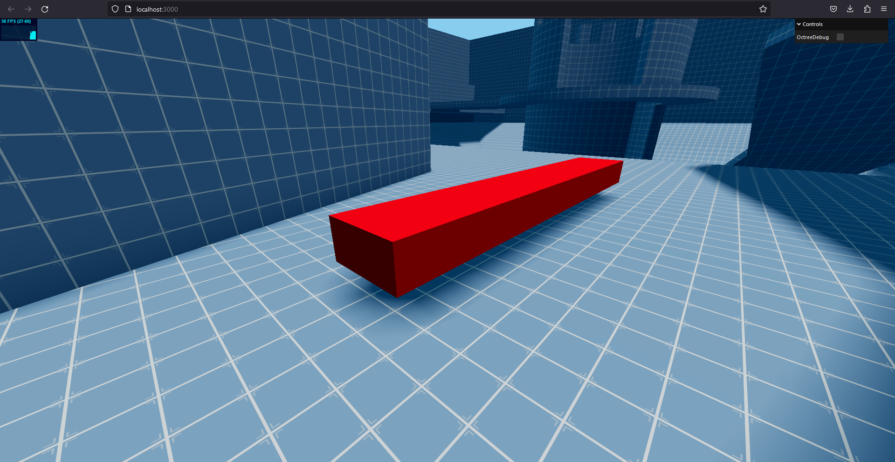

# 🎮 Web-Based First Person Shooter Engine

[](https://www.typescriptlang.org/)
[](https://threejs.org/)
[](LICENSE)

## 📝 Описание

Экспериментальный движок для создания шутеров от первого лица, работающий в браузере. Построен на базе Three.js с использованием современных веб-технологий. Движок предоставляет базовую физику, систему коллизий на основе Octree и редактор уровней через JSON-конфигурацию.

### 🔑 Ключевые особенности

- **Производительная физика** благодаря оптимизированной системе коллизий Octree
- **Динамическое освещение** с поддержкой теней
- **Редактор карт** через JSON-конфигурацию
- **Настраиваемые параметры игрока** через удобный GUI-интерфейс
- **Поддержка моделей** в формате GLTF/GLB
- **Строгая типизация** благодаря TypeScript

## 🛠 Технологический стек

- TypeScript
- Three.js
- Vite
- WebGL

## 📁 Структура проекта

```
├── docs/
│   └── img/                # Скриншоты и изображения для документации
├── public/
│   └── models/             # 3D модели в формате GLTF/GLB
├── src/
│   ├── config/             # Конфигурационные файлы
│   │   ├── map.ts          # Конфигурация игровых карт
│   │   └── settings.ts     # Основные настройки игры
│   ├── core/               # Ядро движка
│   │   ├── Game.ts         # Основной класс игры
│   │   └── Player.ts       # Логика игрока
│   ├── types/              # TypeScript интерфейсы и типы
│   │   └── index.ts        # Основные типы
│   └── main.ts             # Точка входа приложения
├── index.html              # HTML шаблон
├── tsconfig.json           # Конфигурация TypeScript
├── package.json            # Зависимости и скрипты
├── vite.config.ts          # Конфигурация Vite
├── LICENSE                 # Лицензия MIT
└── README.md               # Документация проекта
```

### 📂 Описание ключевых директорий

- **src/core/**: Содержит основную логику движка
- **src/config/**: Конфигурационные файлы для настройки игры и карт
- **src/types/**: TypeScript интерфейсы и типы
- **public/models/**: 3D модели и ресурсы
- **docs/**: Документация и медиа файлы

## 📋 Журнал изменений

### v0.6.0 (Текущая версия)
- 🔄 Полная миграция кодовой базы на TypeScript
- ✨ Добавлены строгие типы для всех компонентов
- 📦 Реорганизована структура проекта
- 🔧 Внедрены интерфейсы для конфигураций
- 🛠 Улучшена система сборки с использованием Vite
- 📚 Добавлена базовая документация типов

### v0.5.0
- ✨ Реализована базовая система редактирования карт через JSON-конфигурацию
  ```typescript
  interface MapConfig {
    STATIC_OBJECTS: {
      LOAD_OBJECTS: Array<{position: Vector3, file: string}>;
      THREE_OBJECTS: Array<{
        type: string,
        position: Vector3,
        geometry: Vector3,
        color: string
      }>;
    }
  }
  ```
  
### v0.4.0
- ✨ Разработан класс `Player` с полной игровой логикой
- 🔧 Реализована система движения и прыжков
- 🎮 Добавлено управление с клавиатуры и мыши
- 📊 Внедрена система обработки коллизий

### v0.3.0
- 🌞 Добавлена система динамического освещения
- 🎨 Реализованы динамические тени
- ✨ Внедрен направленный свет для имитации солнечного освещения

### v0.2.0
- 🔧 Добавлена панель отладки
- 📊 Реализована визуализация Octree
- ⚙️ Добавлены настройки производительности

### v0.1.0
- 🎮 Создан базовый игровой движок
- 📦 Настроена базовая Three.js сцена
- 🎥 Реализована базовая камера от первого лица

## 🖼 Скриншоты

<details>
<summary>Развернуть галерею</summary>

#### Базовая сцена


#### Панель отладки


#### Визуализация Octree


#### Система освещения


#### Редактор карт


</details>

## 📚 Документация

Подробная документация по API и примеры использования находятся в разработке. Типы и интерфейсы документированы в исходном коде.

## 🤝 Участие в разработке

Проект находится в активной разработке. Если вы хотите внести свой вклад, пожалуйста, ознакомьтесь с нашим руководством по участию в разработке.

## 📄 Лицензия

Проект распространяется под лицензией MIT. Подробности в файле [LICENSE](LICENSE).